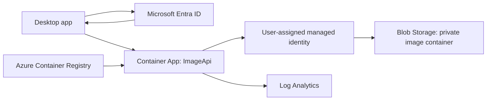
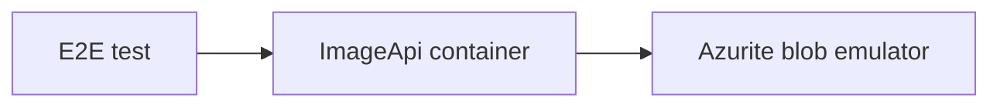

# End-to-end Azure Container Apps tutorial

This tutorial starts from a clean repository and builds a small image-transfer
API for Azure.

The API lets a signed-in corporate user upload images, list their own images,
download their own images, and verify that the uploaded and downloaded bytes
match. It runs locally with Docker and Azurite, then deploys to Azure Container
Apps with Bicep.

The tutorial favors plain, explicit choices over magic:

- ASP.NET Core Minimal API for HTTP;
- Azure Container Apps for hosting;
- Azure Blob Storage for image bytes and starter metadata;
- Microsoft Entra ID bearer tokens for cloud auth;
- Bicep for Azure infrastructure;
- Docker for repeatable local and publish flows;
- optional Native AOT with a normal non-AOT fallback.

Native AOT is useful, but it is not the soul of the project. We write the app in
an AOT-friendly style and verify the published image. If AOT gets in the way of
the application, keep the Container Apps architecture and drop AOT.

## 1. What You Will Build

The finished proof of concept has four user-facing API operations:

```http
GET  /api/health
GET  /api/images
POST /api/images
GET  /api/images/{imageId}
```

The health endpoint is anonymous. The image endpoints are authenticated.

Each signed-in user can see only their own images. The first version does not
include sharing, SQL, API Management, private networking, or CI/CD. Those are
good next stages, not day-one requirements.

The end-to-end test does this:

1. generate a deterministic tiny PNG;
2. hash the bytes with SHA-256;
3. upload the image;
4. download the same image;
5. hash the downloaded bytes;
6. assert that both hashes match.

## 2. Architecture

Cloud flow:



Local flow:



The application uses two different storage connection modes:

- local development uses an Azurite connection string;
- Azure uses managed identity and the Blob service URI.

The application uses two different auth modes:

- local development can use a development-only `X-Dev-User` header;
- Azure validates Microsoft Entra ID bearer tokens.

Those modes are intentionally explicit. Local shortcuts must not be enabled in
Azure.

## 3. Prerequisites

Install these tools:

- .NET 10 SDK;
- Docker Desktop;
- Azure CLI;
- Bicep support through Azure CLI;
- Git;
- an Azure subscription.

Verify them:

```bash
dotnet --info
docker version
az --version
az bicep version
git --version
```

Sign in to Azure:

```bash
az login
az account set --subscription "<subscription-id>"
```

For the first pass, use a dedicated resource group. Resource-group deletion is
the cleanest teardown story for a tutorial.

```bash
export RESOURCE_GROUP="rg-image-api-dev"
export LOCATION="canadacentral"

az group create \
  --name "$RESOURCE_GROUP" \
  --location "$LOCATION"
```

If your organization requires least-privilege deployment identities, have an
administrator create a deployment principal scoped to this resource group. The
deployer needs enough permission to create resources and role assignments within
the resource group.

## 4. Repository Layout

Create this layout:

```text
ImageTransferApi/
  .dockerignore
  .env.example
  .gitignore
  Directory.Packages.props
  docker-compose.yml
  END_TO_END_CONTAINER_APP_TUTORIAL.md
  global.json
  README.md
  docs/
    architecture-decision-container-apps.md
  infra/
    main.bicep
    registry.bicep
  scripts/
    build-image.sh
    deploy-infra.sh
    deploy-registry.sh
    init-local-env.ps1
    preflight.sh
    smoke-test.sh
    teardown-cloud.sh
  src/
    ImageApi/
      Dockerfile
      ImageApi.csproj
      Program.cs
      Auth/
        CurrentUser.cs
      Models/
        ApiModels.cs
      Storage/
        BlobServiceClientFactory.cs
        ImageBlobStore.cs
  tests/
    ImageApi.E2E/
      ImageApi.E2E.csproj
      ImageRoundTripTests.cs
```

Create the directories:

```bash
mkdir -p docs infra scripts src/ImageApi/{Auth,Models,Storage} tests/ImageApi.E2E
```

## 5. Root Files

### 5.1 `global.json`

Pin the SDK family so local and container builds agree.

```json
{
  "sdk": {
    "version": "10.0.100",
    "rollForward": "latestFeature"
  }
}
```

### 5.2 `Directory.Packages.props`

Use central package management so package versions are easy to review.

```xml
<Project>
  <PropertyGroup>
    <ManagePackageVersionsCentrally>true</ManagePackageVersionsCentrally>
  </PropertyGroup>

  <ItemGroup>
    <PackageVersion Include="Azure.Identity" Version="1.21.0" />
    <PackageVersion Include="Azure.Storage.Blobs" Version="12.27.0" />
    <PackageVersion Include="Microsoft.AspNetCore.Authentication.JwtBearer" Version="10.0.0" />

    <PackageVersion Include="Microsoft.NET.Test.Sdk" Version="18.5.1" />
    <PackageVersion Include="xunit" Version="2.9.3" />
    <PackageVersion Include="xunit.runner.visualstudio" Version="3.1.5" />
  </ItemGroup>
</Project>
```

### 5.3 `.gitignore`

```gitignore
bin/
obj/
.artifacts/
.vs/
.vscode/
*.user
*.suo
*.binlog
TestResults/
.env
```

### 5.4 `.dockerignore`

Keep Docker build context small and avoid copying local artifacts.

```dockerignore
**/bin/
**/obj/
.artifacts/
.git/
.vs/
.vscode/
TestResults/
```

## 6. Minimal API Project

### 6.1 `src/ImageApi/ImageApi.csproj`

```xml
<Project Sdk="Microsoft.NET.Sdk.Web">
  <PropertyGroup>
    <TargetFramework>net10.0</TargetFramework>
    <Nullable>enable</Nullable>
    <ImplicitUsings>enable</ImplicitUsings>
    <LangVersion>14.0</LangVersion>

    <PublishAot>true</PublishAot>
    <IsAotCompatible>true</IsAotCompatible>
    <InvariantGlobalization>true</InvariantGlobalization>
    <EnableTrimAnalyzer>true</EnableTrimAnalyzer>
    <EnableSingleFileAnalyzer>true</EnableSingleFileAnalyzer>

    <DebuggerSupport Condition="'$(Configuration)' == 'Release'">false</DebuggerSupport>
    <EventSourceSupport Condition="'$(Configuration)' == 'Release'">false</EventSourceSupport>
  </PropertyGroup>

  <ItemGroup>
    <PackageReference Include="Azure.Identity" />
    <PackageReference Include="Azure.Storage.Blobs" />
    <PackageReference Include="Microsoft.AspNetCore.Authentication.JwtBearer" />
  </ItemGroup>
</Project>
```

The project enables AOT analyzers from the start. That does not mean every build
must publish Native AOT. It means the app should avoid obvious AOT-hostile
patterns while it is still small.

### 6.2 `src/ImageApi/Models/ApiModels.cs`

```csharp
using System.Text.Json.Serialization;

namespace ImageApi.Models;

public sealed record HealthResponse(string Status, string Utc);

public sealed record ErrorResponse(string Error);

public sealed record ImageSummary(
    string ImageId,
    long SizeBytes,
    string ContentType,
    string Sha256,
    string CreatedUtc);

public sealed record UploadImageResponse(
    string ImageId,
    long SizeBytes,
    string ContentType,
    string Sha256);

[JsonSourceGenerationOptions(PropertyNamingPolicy = JsonKnownNamingPolicy.CamelCase)]
[JsonSerializable(typeof(HealthResponse))]
[JsonSerializable(typeof(ErrorResponse))]
[JsonSerializable(typeof(ImageSummary))]
[JsonSerializable(typeof(ImageSummary[]))]
[JsonSerializable(typeof(UploadImageResponse))]
internal sealed partial class AppJsonSerializerContext : JsonSerializerContext;
```

Source-generated JSON keeps serialization compatible with Native AOT. Avoid
falling back to reflection-based JSON serialization.

### 6.3 `src/ImageApi/Auth/CurrentUser.cs`

```csharp
using System.Security.Claims;
using System.Security.Cryptography;

namespace ImageApi.Auth;

public sealed record CurrentUser(
    string TenantId,
    string UserId,
    string DisplayName)
{
    public const string HttpContextItemKey = "ImageApi.CurrentUser";

    public string StableKey => $"{TenantId}:{UserId}";

    public string OwnerHash
    {
        get
        {
            var bytes = SHA256.HashData(System.Text.Encoding.UTF8.GetBytes(StableKey));
            return Convert.ToHexString(bytes).ToLowerInvariant();
        }
    }

    public static CurrentUser FromHttpContext(HttpContext context)
    {
        if (context.Items[HttpContextItemKey] is CurrentUser developmentUser)
        {
            return developmentUser;
        }

        var principal = context.User;

        var tenantId =
            principal.FindFirstValue("tid") ??
            principal.FindFirstValue("http://schemas.microsoft.com/identity/claims/tenantid");

        var userId =
            principal.FindFirstValue("oid") ??
            principal.FindFirstValue("http://schemas.microsoft.com/identity/claims/objectidentifier");

        var displayName =
            principal.FindFirstValue("name") ??
            principal.FindFirstValue("preferred_username") ??
            "unknown";

        if (string.IsNullOrWhiteSpace(tenantId) || string.IsNullOrWhiteSpace(userId))
        {
            throw new InvalidOperationException("Authenticated user is missing tenant or object ID claims.");
        }

        return new CurrentUser(tenantId, userId, displayName);
    }

    public static CurrentUser FromDevelopmentUser(string name)
    {
        if (string.IsNullOrWhiteSpace(name))
        {
            throw new ArgumentException("Development user name is required.", nameof(name));
        }

        return new CurrentUser("development", name.Trim(), name.Trim());
    }
}
```

The owner key uses Entra tenant ID plus object ID. Do not use email addresses as
primary identifiers. Emails can change; object IDs are the durable user identity
inside a tenant.

### 6.4 `src/ImageApi/Storage/BlobServiceClientFactory.cs`

```csharp
using Azure.Core;
using Azure.Identity;
using Azure.Storage.Blobs;

namespace ImageApi.Storage;

internal static class BlobServiceClientFactory
{
    public static BlobServiceClient CreateFromEnvironment()
    {
        var connectionString = Environment.GetEnvironmentVariable("ImageStorageConnectionString");
        if (!string.IsNullOrWhiteSpace(connectionString))
        {
            return new BlobServiceClient(connectionString);
        }

        var serviceUri = Environment.GetEnvironmentVariable("ImageStorageBlobServiceUri");
        if (string.IsNullOrWhiteSpace(serviceUri))
        {
            throw new InvalidOperationException(
                "Set ImageStorageConnectionString for local development or " +
                "ImageStorageBlobServiceUri for Azure managed-identity access.");
        }

        var managedIdentityClientId =
            Environment.GetEnvironmentVariable("ImageStorageManagedIdentityClientId") ??
            Environment.GetEnvironmentVariable("AZURE_CLIENT_ID");

        TokenCredential credential = new DefaultAzureCredential(
            new DefaultAzureCredentialOptions
            {
                ManagedIdentityClientId = string.IsNullOrWhiteSpace(managedIdentityClientId)
                    ? null
                    : managedIdentityClientId,
                ExcludeInteractiveBrowserCredential = true
            });

        return new BlobServiceClient(new Uri(serviceUri), credential);
    }
}
```

Local development uses a connection string because Azurite is an emulator.
Azure uses managed identity. Do not put cloud storage account keys in app
settings.

### 6.5 `src/ImageApi/Storage/ImageBlobStore.cs`

```csharp
using System.Security.Cryptography;
using Azure;
using Azure.Storage.Blobs;
using Azure.Storage.Blobs.Models;
using ImageApi.Auth;
using ImageApi.Models;

namespace ImageApi.Storage;

public sealed class ImageBlobStore
{
    private readonly BlobContainerClient _container;

    public ImageBlobStore(BlobServiceClient blobServiceClient)
    {
        var containerName = Environment.GetEnvironmentVariable("ImageStorageContainerName");
        if (string.IsNullOrWhiteSpace(containerName))
        {
            containerName = "images";
        }

        _container = blobServiceClient.GetBlobContainerClient(containerName);
    }

    public async Task<ImageSummary[]> ListAsync(CurrentUser owner, CancellationToken cancellationToken)
    {
        await _container.CreateIfNotExistsAsync(cancellationToken: cancellationToken);

        var results = new List<ImageSummary>();
        var prefix = OwnerPrefix(owner);

        await foreach (var blob in _container.GetBlobsAsync(
            traits: BlobTraits.Metadata,
            prefix: prefix,
            cancellationToken: cancellationToken))
        {
            var imageId = blob.Name[prefix.Length..];
            var contentType = blob.Properties.ContentType ?? "application/octet-stream";
            var size = blob.Properties.ContentLength ?? 0;
            var created = blob.Properties.CreatedOn ?? DateTimeOffset.UnixEpoch;

            blob.Metadata.TryGetValue("sha256", out var sha256);

            results.Add(new ImageSummary(
                imageId,
                size,
                contentType,
                sha256 ?? string.Empty,
                created.ToString("O")));
        }

        return results
            .OrderByDescending(static image => image.CreatedUtc, StringComparer.Ordinal)
            .ToArray();
    }

    public async Task<StoredImage> UploadAsync(
        CurrentUser owner,
        byte[] bytes,
        string contentType,
        CancellationToken cancellationToken)
    {
        await _container.CreateIfNotExistsAsync(cancellationToken: cancellationToken);

        var imageId = $"{Guid.NewGuid():N}{ExtensionForContentType(contentType)}";
        var blobName = BlobNameFor(owner, imageId);
        var sha256 = Sha256Hex(bytes);
        var createdUtc = DateTimeOffset.UtcNow;

        await using var stream = new MemoryStream(bytes, writable: false);
        await _container.GetBlobClient(blobName).UploadAsync(
            stream,
            new BlobUploadOptions
            {
                HttpHeaders = new BlobHttpHeaders
                {
                    ContentType = contentType
                },
                Metadata = new Dictionary<string, string>(StringComparer.Ordinal)
                {
                    ["owner_hash"] = owner.OwnerHash,
                    ["sha256"] = sha256,
                    ["created_utc"] = createdUtc.ToString("O")
                }
            },
            cancellationToken);

        return new StoredImage(imageId, bytes.Length, contentType, sha256);
    }

    public async Task<DownloadedImage?> DownloadAsync(
        CurrentUser owner,
        string imageId,
        CancellationToken cancellationToken)
    {
        if (!IsSafeImageId(imageId))
        {
            return null;
        }

        var blob = _container.GetBlobClient(BlobNameFor(owner, imageId));

        try
        {
            var response = await blob.DownloadContentAsync(cancellationToken);
            var bytes = response.Value.Content.ToArray();
            var contentType = string.IsNullOrWhiteSpace(response.Value.Details.ContentType)
                ? "application/octet-stream"
                : response.Value.Details.ContentType;

            return new DownloadedImage(imageId, bytes, contentType, Sha256Hex(bytes));
        }
        catch (RequestFailedException ex) when (ex.Status == 404)
        {
            return null;
        }
    }

    private static string OwnerPrefix(CurrentUser owner) => $"users/{owner.OwnerHash}/";

    private static string BlobNameFor(CurrentUser owner, string imageId) => OwnerPrefix(owner) + imageId;

    private static bool IsSafeImageId(string imageId)
    {
        if (string.IsNullOrWhiteSpace(imageId) || imageId.Length > 160)
        {
            return false;
        }

        if (imageId.Contains("..", StringComparison.Ordinal) ||
            imageId.Contains('/', StringComparison.Ordinal) ||
            imageId.Contains('\\', StringComparison.Ordinal))
        {
            return false;
        }

        return imageId.All(static ch =>
            char.IsAsciiLetterOrDigit(ch) || ch is '.' or '_' or '-');
    }

    private static string ExtensionForContentType(string contentType) =>
        contentType.ToLowerInvariant() switch
        {
            "image/png" => ".png",
            "image/jpeg" => ".jpg",
            "image/gif" => ".gif",
            "image/webp" => ".webp",
            _ => ".bin"
        };

    private static string Sha256Hex(ReadOnlySpan<byte> bytes) =>
        Convert.ToHexString(SHA256.HashData(bytes)).ToLowerInvariant();
}

public sealed record StoredImage(string ImageId, long SizeBytes, string ContentType, string Sha256);

public sealed record DownloadedImage(string ImageId, byte[] Bytes, string ContentType, string Sha256);
```

This starter keeps metadata in Blob Storage. That is enough for per-user
ownership and a simple list operation. Add SQL only when sharing, search,
auditing, or richer business rules need it.

### 6.6 `src/ImageApi/Program.cs`

```csharp
using System.Buffers;
using ImageApi.Auth;
using ImageApi.Models;
using ImageApi.Storage;
using Microsoft.AspNetCore.Authentication.JwtBearer;

var builder = WebApplication.CreateSlimBuilder(args);

builder.Services.ConfigureHttpJsonOptions(static options =>
{
    options.SerializerOptions.TypeInfoResolverChain.Insert(0, AppJsonSerializerContext.Default);
});

builder.Services.AddSingleton(static _ => BlobServiceClientFactory.CreateFromEnvironment());
builder.Services.AddSingleton<ImageBlobStore>();

var useDevelopmentAuth =
    builder.Environment.IsDevelopment() &&
    builder.Configuration.GetValue("Authentication:UseDevelopmentUser", false);

if (!useDevelopmentAuth)
{
    var tenantId = builder.Configuration["Authentication:TenantId"];
    var audience = builder.Configuration["Authentication:Audience"];

    if (string.IsNullOrWhiteSpace(tenantId) || string.IsNullOrWhiteSpace(audience))
    {
        throw new InvalidOperationException(
            "Authentication:TenantId and Authentication:Audience are required outside development auth mode.");
    }

    builder.Services
        .AddAuthentication(JwtBearerDefaults.AuthenticationScheme)
        .AddJwtBearer(options =>
        {
            options.Authority = $"https://login.microsoftonline.com/{tenantId}/v2.0";
            options.Audience = audience;
        });

    builder.Services.AddAuthorization();
}

var app = builder.Build();

if (useDevelopmentAuth)
{
    app.Use(async (context, next) =>
    {
        if (context.Request.Path.StartsWithSegments("/api/images"))
        {
            var devUser = context.Request.Headers["X-Dev-User"].FirstOrDefault();
            if (string.IsNullOrWhiteSpace(devUser))
            {
                context.Response.StatusCode = StatusCodes.Status401Unauthorized;
                await context.Response.WriteAsJsonAsync(
                    new ErrorResponse("Set X-Dev-User for local development requests."),
                    AppJsonSerializerContext.Default.ErrorResponse);
                return;
            }

            context.Items[CurrentUser.HttpContextItemKey] = CurrentUser.FromDevelopmentUser(devUser);
        }

        await next(context);
    });
}
else
{
    app.UseAuthentication();
    app.UseAuthorization();
}

app.MapGet("/api/health", () =>
    Results.Ok(new HealthResponse("ok", DateTimeOffset.UtcNow.ToString("O"))));

var images = app.MapGroup("/api/images");
if (!useDevelopmentAuth)
{
    images.RequireAuthorization();
}

images.MapGet("/", async (HttpContext context, ImageBlobStore store, CancellationToken cancellationToken) =>
{
    var user = CurrentUser.FromHttpContext(context);
    var images = await store.ListAsync(user, cancellationToken);
    return Results.Ok(images);
});

images.MapPost("/", async (HttpContext context, ImageBlobStore store, CancellationToken cancellationToken) =>
{
    const long maxImageBytes = 10 * 1024 * 1024;

    byte[] bytes;
    try
    {
        bytes = await ReadBodyWithLimitAsync(context.Request.Body, maxImageBytes, cancellationToken);
    }
    catch (PayloadTooLargeException)
    {
        return Results.Json(
            new ErrorResponse($"Image must be at most {maxImageBytes} bytes."),
            statusCode: StatusCodes.Status413PayloadTooLarge);
    }

    if (bytes.Length == 0)
    {
        return Results.BadRequest(new ErrorResponse("Request body is empty."));
    }

    if (!TryDetectImageContentType(bytes, out var detectedContentType))
    {
        return Results.Json(
            new ErrorResponse("Only PNG, JPEG, GIF, and WebP images are accepted."),
            statusCode: StatusCodes.Status415UnsupportedMediaType);
    }

    var requestContentType = context.Request.ContentType;
    var contentType = IsImageContentType(requestContentType) ? requestContentType! : detectedContentType;
    var user = CurrentUser.FromHttpContext(context);
    var stored = await store.UploadAsync(user, bytes, contentType, cancellationToken);

    return Results.Created(
        $"/api/images/{Uri.EscapeDataString(stored.ImageId)}",
        new UploadImageResponse(stored.ImageId, stored.SizeBytes, stored.ContentType, stored.Sha256));
});

images.MapGet("/{imageId}", async (
    string imageId,
    HttpContext context,
    ImageBlobStore store,
    CancellationToken cancellationToken) =>
{
    var user = CurrentUser.FromHttpContext(context);
    var image = await store.DownloadAsync(user, imageId, cancellationToken);
    if (image is null)
    {
        return Results.NotFound(new ErrorResponse("Image was not found."));
    }

    context.Response.Headers["x-content-sha256"] = image.Sha256;
    return Results.File(image.Bytes, image.ContentType, image.ImageId);
});

app.Run();

static async Task<byte[]> ReadBodyWithLimitAsync(
    Stream body,
    long maxBytes,
    CancellationToken cancellationToken)
{
    using var memory = new MemoryStream();
    var buffer = ArrayPool<byte>.Shared.Rent(81920);

    try
    {
        long total = 0;
        while (true)
        {
            var read = await body.ReadAsync(buffer.AsMemory(0, buffer.Length), cancellationToken);
            if (read == 0)
            {
                break;
            }

            total += read;
            if (total > maxBytes)
            {
                throw new PayloadTooLargeException();
            }

            memory.Write(buffer, 0, read);
        }

        return memory.ToArray();
    }
    finally
    {
        ArrayPool<byte>.Shared.Return(buffer);
    }
}

static bool IsImageContentType(string? contentType) =>
    contentType is not null &&
    contentType.StartsWith("image/", StringComparison.OrdinalIgnoreCase);

static bool TryDetectImageContentType(ReadOnlySpan<byte> bytes, out string contentType)
{
    contentType = string.Empty;

    ReadOnlySpan<byte> png = [137, 80, 78, 71, 13, 10, 26, 10];
    ReadOnlySpan<byte> jpg = [255, 216, 255];
    ReadOnlySpan<byte> gif87 = [71, 73, 70, 56, 55, 97];
    ReadOnlySpan<byte> gif89 = [71, 73, 70, 56, 57, 97];
    ReadOnlySpan<byte> riff = [82, 73, 70, 70];
    ReadOnlySpan<byte> webp = [87, 69, 66, 80];

    if (bytes.StartsWith(png))
    {
        contentType = "image/png";
        return true;
    }

    if (bytes.StartsWith(jpg))
    {
        contentType = "image/jpeg";
        return true;
    }

    if (bytes.StartsWith(gif87) || bytes.StartsWith(gif89))
    {
        contentType = "image/gif";
        return true;
    }

    if (bytes.Length >= 12 && bytes[..4].SequenceEqual(riff) && bytes[8..12].SequenceEqual(webp))
    {
        contentType = "image/webp";
        return true;
    }

    return false;
}

sealed class PayloadTooLargeException : Exception;
```

This app accepts raw image bytes in the POST body. That keeps the tutorial
focused. For larger production uploads, consider direct-to-Blob uploads later.

## 7. Local Docker Runtime

### 7.1 `src/ImageApi/Dockerfile`

```dockerfile
# syntax=docker/dockerfile:1.7

FROM mcr.microsoft.com/dotnet/sdk:10.0 AS restore

WORKDIR /repo

COPY global.json Directory.Packages.props ./
COPY src/ImageApi/ImageApi.csproj src/ImageApi/
RUN dotnet restore src/ImageApi/ImageApi.csproj

COPY src/ImageApi/ src/ImageApi/

FROM restore AS normal-publish
RUN dotnet publish src/ImageApi/ImageApi.csproj \
    -c Release \
    -o /out \
    /p:PublishAot=false \
    /p:UseAppHost=false

FROM mcr.microsoft.com/dotnet/aspnet:10.0 AS runtime
WORKDIR /app
ENV ASPNETCORE_URLS=http://+:8080
EXPOSE 8080
COPY --from=normal-publish /out ./
ENTRYPOINT ["dotnet", "ImageApi.dll"]

FROM restore AS aot-publish
RUN apt-get update \
    && apt-get install -y --no-install-recommends clang zlib1g-dev \
    && rm -rf /var/lib/apt/lists/*

RUN dotnet publish src/ImageApi/ImageApi.csproj \
    -c Release \
    -r linux-x64 \
    --self-contained true \
    -o /out \
    /p:PublishAot=true \
    /p:InvariantGlobalization=true

FROM mcr.microsoft.com/dotnet/runtime-deps:10.0 AS aot-runtime
WORKDIR /app
ENV ASPNETCORE_URLS=http://+:8080
EXPOSE 8080
COPY --from=aot-publish /out ./
ENTRYPOINT ["/app/ImageApi"]
```

Use the normal `runtime` target first. Once local behavior is stable, test the
`aot-runtime` target with the same E2E tests.

### 7.2 `.env.example`

Do not commit Azurite account keys. Keep the committed example file boring and
generate the real `.env` file locally.

```text
# Use this file as a reference. Prefer running scripts/init-local-env.ps1.
# If you copy it to .env by hand, replace AZURITE_ACCOUNT_KEY first.
# .env is intentionally ignored because the key is generated locally.
AZURITE_ACCOUNT_NAME=localstore
AZURITE_ACCOUNT_KEY=generate-with-scripts-init-local-env
```

Generate the real local `.env` file:

```powershell
.\scripts\init-local-env.ps1
```

The generated `.env` file is ignored by Git.

### 7.3 `docker-compose.yml`

```yaml
services:
  azurite:
    image: mcr.microsoft.com/azure-storage/azurite:latest
    command: >
      azurite
      --blobHost 0.0.0.0
      --queueHost 0.0.0.0
      --tableHost 0.0.0.0
      --skipApiVersionCheck
      --disableTelemetry
    environment:
      AZURITE_ACCOUNTS: "${AZURITE_ACCOUNT_NAME:?Run scripts/init-local-env.ps1}:${AZURITE_ACCOUNT_KEY:?Run scripts/init-local-env.ps1}"
    ports:
      - "10000:10000"
      - "10001:10001"
      - "10002:10002"
    volumes:
      - azurite-data:/data

  api:
    build:
      context: .
      dockerfile: src/ImageApi/Dockerfile
      target: runtime
    ports:
      - "8080:8080"
    environment:
      ASPNETCORE_ENVIRONMENT: "Development"
      Authentication__UseDevelopmentUser: "true"
      ImageStorageConnectionString: "DefaultEndpointsProtocol=http;AccountName=${AZURITE_ACCOUNT_NAME:?Run scripts/init-local-env.ps1};AccountKey=${AZURITE_ACCOUNT_KEY:?Run scripts/init-local-env.ps1};BlobEndpoint=http://azurite:10000/${AZURITE_ACCOUNT_NAME:?Run scripts/init-local-env.ps1};QueueEndpoint=http://azurite:10001/${AZURITE_ACCOUNT_NAME:?Run scripts/init-local-env.ps1};TableEndpoint=http://azurite:10002/${AZURITE_ACCOUNT_NAME:?Run scripts/init-local-env.ps1};"
      ImageStorageContainerName: "images"
    depends_on:
      - azurite

volumes:
  azurite-data:
```

Run locally:

```powershell
.\scripts\init-local-env.ps1
docker compose up -d --build
curl.exe -i http://localhost:8080/api/health
```

Expected health response:

```text
HTTP/1.1 200 OK
...
{"status":"ok","utc":"..."}
```

## 8. End-to-end Test Project

### 8.1 `tests/ImageApi.E2E/ImageApi.E2E.csproj`

```xml
<Project Sdk="Microsoft.NET.Sdk">
  <PropertyGroup>
    <TargetFramework>net10.0</TargetFramework>
    <ImplicitUsings>enable</ImplicitUsings>
    <Nullable>enable</Nullable>
    <LangVersion>14.0</LangVersion>
    <IsPackable>false</IsPackable>
  </PropertyGroup>

  <ItemGroup>
    <PackageReference Include="Microsoft.NET.Test.Sdk" />
    <PackageReference Include="xunit" />
    <PackageReference Include="xunit.runner.visualstudio" PrivateAssets="all" />
  </ItemGroup>
</Project>
```

### 8.2 `tests/ImageApi.E2E/ImageRoundTripTests.cs`

```csharp
using System.Net;
using System.Net.Http.Headers;
using System.Security.Cryptography;
using System.Text.Json;
using Xunit;

namespace ImageApi.E2E;

public sealed class ImageRoundTripTests
{
    private static readonly byte[] TestPng = Convert.FromBase64String(
        "iVBORw0KGgoAAAANSUhEUgAAAAEAAAABCAQAAAC1HAwCAAAAC0lEQVR42mP8/x8AAwMCAO+/p9sAAAAASUVORK5CYII=");

    [Fact]
    public async Task UploadThenDownload_ReturnsSameSha256Hash()
    {
        var baseUrl = GetBaseUrl();

        using var client = new HttpClient
        {
            Timeout = TimeSpan.FromSeconds(60)
        };

        await WaitForHealthAsync(client, baseUrl);

        var expectedHash = Sha256Hex(TestPng);

        using var uploadContent = new ByteArrayContent(TestPng);
        uploadContent.Headers.ContentType = new MediaTypeHeaderValue("image/png");

        using var uploadRequest = CreateRequest(HttpMethod.Post, new Uri($"{baseUrl}/images"));
        uploadRequest.Content = uploadContent;

        using var uploadResponse = await client.SendAsync(uploadRequest);
        var uploadBody = await uploadResponse.Content.ReadAsStringAsync();
        Assert.True(uploadResponse.IsSuccessStatusCode, uploadBody);

        var upload = JsonSerializer.Deserialize<UploadImageResponse>(
            uploadBody,
            new JsonSerializerOptions(JsonSerializerDefaults.Web));

        Assert.NotNull(upload);
        Assert.Equal(expectedHash, upload.Sha256);

        using var downloadRequest = CreateRequest(
            HttpMethod.Get,
            new Uri($"{baseUrl}/images/{Uri.EscapeDataString(upload.ImageId)}"));

        using var downloadResponse = await client.SendAsync(downloadRequest);
        Assert.Equal(HttpStatusCode.OK, downloadResponse.StatusCode);

        var downloadedBytes = await downloadResponse.Content.ReadAsByteArrayAsync();
        var actualHash = Sha256Hex(downloadedBytes);

        Assert.Equal(expectedHash, actualHash);

        if (downloadResponse.Headers.TryGetValues("x-content-sha256", out var values))
        {
            Assert.Equal(expectedHash, Assert.Single(values));
        }
    }

    private static string GetBaseUrl()
    {
        var configured = Environment.GetEnvironmentVariable("API_BASE_URL");
        return string.IsNullOrWhiteSpace(configured)
            ? "http://localhost:8080/api"
            : configured.TrimEnd('/');
    }

    private static HttpRequestMessage CreateRequest(HttpMethod method, Uri uri)
    {
        var request = new HttpRequestMessage(method, uri);

        var token = Environment.GetEnvironmentVariable("API_ACCESS_TOKEN");
        if (!string.IsNullOrWhiteSpace(token))
        {
            request.Headers.Authorization = new AuthenticationHeaderValue("Bearer", token);
            return request;
        }

        if (uri.IsLoopback)
        {
            request.Headers.Add("X-Dev-User", "e2e-user");
        }

        return request;
    }

    private static async Task WaitForHealthAsync(HttpClient client, string baseUrl)
    {
        var deadline = DateTimeOffset.UtcNow.AddSeconds(60);
        var healthUri = new Uri($"{baseUrl}/health");

        while (DateTimeOffset.UtcNow < deadline)
        {
            try
            {
                using var response = await client.GetAsync(healthUri);
                if (response.IsSuccessStatusCode)
                {
                    return;
                }
            }
            catch (HttpRequestException)
            {
                // The container may still be starting.
            }
            catch (TaskCanceledException)
            {
                // The container may still be starting.
            }

            await Task.Delay(TimeSpan.FromSeconds(2));
        }

        throw new TimeoutException($"API did not become healthy at {healthUri}.");
    }

    private static string Sha256Hex(ReadOnlySpan<byte> bytes) =>
        Convert.ToHexString(SHA256.HashData(bytes)).ToLowerInvariant();

    private sealed record UploadImageResponse(
        string ImageId,
        long SizeBytes,
        string ContentType,
        string Sha256);
}
```

Run the local E2E test:

```bash
docker compose up -d --build
dotnet test tests/ImageApi.E2E/ImageApi.E2E.csproj
docker compose down -v
```

The same test will run against Azure later by setting `API_BASE_URL` and
`API_ACCESS_TOKEN`.

## 9. Prove Native AOT Locally

Build and run the AOT container target:

```bash
docker compose down -v
docker build \
  -f src/ImageApi/Dockerfile \
  --target aot-runtime \
  -t image-api:aot \
  .
```

Run it with Azurite:

```bash
docker compose up -d azurite

set -a
source .env
set +a

docker run --rm \
  --name image-api-aot \
  --network "$(basename "$PWD")_default" \
  -p 8080:8080 \
  -e ASPNETCORE_ENVIRONMENT=Development \
  -e Authentication__UseDevelopmentUser=true \
  -e ImageStorageContainerName=images \
  -e "ImageStorageConnectionString=DefaultEndpointsProtocol=http;AccountName=${AZURITE_ACCOUNT_NAME};AccountKey=${AZURITE_ACCOUNT_KEY};BlobEndpoint=http://azurite:10000/${AZURITE_ACCOUNT_NAME};QueueEndpoint=http://azurite:10001/${AZURITE_ACCOUNT_NAME};TableEndpoint=http://azurite:10002/${AZURITE_ACCOUNT_NAME};" \
  image-api:aot
```

In another terminal:

```bash
dotnet test tests/ImageApi.E2E/ImageApi.E2E.csproj
```

Treat AOT warnings as meaningful. If the AOT image behaves differently from the
normal image, fix the issue or choose the normal image for the PoC.

## 10. Microsoft Entra ID Auth Setup

The API validates Entra bearer tokens in Azure. For the first tutorial pass,
create the app registrations manually or through a small admin script approved
by your organization.

You need two registrations:

1. API registration: represents this backend API.
2. Desktop client registration: represents the native desktop application.

API registration settings:

- supported account type: single tenant for the corporate tenant;
- Application ID URI: `api://<api-client-id>`;
- exposed delegated scope: `access_as_user`;
- no client secret required for the API itself.

Desktop client settings:

- platform: mobile and desktop applications;
- redirect URI: `http://localhost`;
- public client flow allowed if your desktop auth flow requires it;
- delegated API permission: `access_as_user` on the API registration.

The Container App needs these settings:

```text
Authentication__TenantId=<tenant-id>
Authentication__Audience=api://<api-client-id>
```

The desktop app later requests a token for:

```text
api://<api-client-id>/access_as_user
```

For automated cloud E2E tests, provide a valid token through:

```bash
export API_ACCESS_TOKEN="<access-token>"
```

The tutorial keeps token acquisition separate from the API implementation. That
avoids burying desktop-client auth details inside the backend tutorial.

## 11. Infrastructure With Bicep

The deployment uses two Bicep files:

- `registry.bicep` creates Azure Container Registry first;
- `main.bicep` deploys the app infrastructure after an image has been built.

This two-step shape avoids deploying a Container App that points at an image
that does not exist yet.

### 11.1 `infra/registry.bicep`

```bicep
targetScope = 'resourceGroup'

@description('Azure region for the container registry.')
param location string = resourceGroup().location

@description('Short lowercase prefix used for resource names. Use letters and numbers only.')
@minLength(3)
@maxLength(10)
param resourcePrefix string

var uniqueSuffix = uniqueString(resourceGroup().id, resourcePrefix)
var acrName = toLower(take('${resourcePrefix}acr${uniqueSuffix}', 50))

resource acr 'Microsoft.ContainerRegistry/registries@2023-07-01' = {
  name: acrName
  location: location
  sku: {
    name: 'Basic'
  }
  properties: {
    adminUserEnabled: false
    publicNetworkAccess: 'Enabled'
  }
}

output acrName string = acr.name
output acrLoginServer string = acr.properties.loginServer
```

### 11.2 `infra/main.bicep`

```bicep
targetScope = 'resourceGroup'

@description('Azure region for all resources.')
param location string = resourceGroup().location

@description('Short lowercase prefix used for resource names. Use letters and numbers only.')
@minLength(3)
@maxLength(10)
param resourcePrefix string

@description('Existing Azure Container Registry name.')
param acrName string

@description('Full container image name, including registry, repository, and tag.')
param containerImage string

@description('Microsoft Entra tenant ID used for JWT validation.')
param authenticationTenantId string

@description('Expected JWT audience, usually api://<api-app-client-id>.')
param authenticationAudience string

@description('Blob container name for uploaded images.')
param imageContainerName string = 'images'

@description('Minimum Container App replicas. Use 0 for low-cost PoC scale-to-zero.')
@minValue(0)
@maxValue(10)
param minReplicas int = 0

@description('Maximum Container App replicas.')
@minValue(1)
@maxValue(100)
param maxReplicas int = 3

var uniqueSuffix = uniqueString(resourceGroup().id, resourcePrefix)

var appName = '${resourcePrefix}-api-${uniqueSuffix}'
var envName = '${resourcePrefix}-env-${uniqueSuffix}'
var identityName = '${resourcePrefix}-id-${uniqueSuffix}'
var logAnalyticsName = '${resourcePrefix}-log-${uniqueSuffix}'
var imageStorageName = take('${resourcePrefix}img${uniqueSuffix}', 24)

var acrPullRoleId = '7f951dda-4ed3-4680-a7ca-43fe172d538d'
var storageBlobDataContributorRoleId = 'ba92f5b4-2d11-453d-a403-e96b0029c9fe'

resource acr 'Microsoft.ContainerRegistry/registries@2023-07-01' existing = {
  name: acrName
}

resource appIdentity 'Microsoft.ManagedIdentity/userAssignedIdentities@2023-01-31' = {
  name: identityName
  location: location
}

resource imageStorage 'Microsoft.Storage/storageAccounts@2023-05-01' = {
  name: imageStorageName
  location: location
  sku: {
    name: 'Standard_LRS'
  }
  kind: 'StorageV2'
  properties: {
    allowBlobPublicAccess: false
    allowSharedKeyAccess: false
    minimumTlsVersion: 'TLS1_2'
    supportsHttpsTrafficOnly: true
  }
}

resource imageBlobService 'Microsoft.Storage/storageAccounts/blobServices@2023-05-01' = {
  name: 'default'
  parent: imageStorage
}

resource imageContainer 'Microsoft.Storage/storageAccounts/blobServices/containers@2023-05-01' = {
  name: imageContainerName
  parent: imageBlobService
  properties: {
    publicAccess: 'None'
  }
}

resource logAnalytics 'Microsoft.OperationalInsights/workspaces@2023-09-01' = {
  name: logAnalyticsName
  location: location
  properties: {
    sku: {
      name: 'PerGB2018'
    }
    retentionInDays: 30
  }
}

resource containerEnvironment 'Microsoft.App/managedEnvironments@2026-01-01' = {
  name: envName
  location: location
  properties: {
    appLogsConfiguration: {
      destination: 'log-analytics'
      logAnalyticsConfiguration: {
        customerId: logAnalytics.properties.customerId
        sharedKey: logAnalytics.listKeys().primarySharedKey
      }
    }
  }
}

resource acrPull 'Microsoft.Authorization/roleAssignments@2022-04-01' = {
  name: guid(acr.id, appIdentity.id, acrPullRoleId)
  scope: acr
  properties: {
    roleDefinitionId: subscriptionResourceId('Microsoft.Authorization/roleDefinitions', acrPullRoleId)
    principalId: appIdentity.properties.principalId
    principalType: 'ServicePrincipal'
  }
}

resource blobDataContributor 'Microsoft.Authorization/roleAssignments@2022-04-01' = {
  name: guid(imageContainer.id, appIdentity.id, storageBlobDataContributorRoleId)
  scope: imageContainer
  properties: {
    roleDefinitionId: subscriptionResourceId('Microsoft.Authorization/roleDefinitions', storageBlobDataContributorRoleId)
    principalId: appIdentity.properties.principalId
    principalType: 'ServicePrincipal'
  }
}

resource containerApp 'Microsoft.App/containerApps@2026-01-01' = {
  name: appName
  location: location
  identity: {
    type: 'UserAssigned'
    userAssignedIdentities: {
      '${appIdentity.id}': {}
    }
  }
  properties: {
    environmentId: containerEnvironment.id
    configuration: {
      activeRevisionsMode: 'Single'
      ingress: {
        external: true
        targetPort: 8080
        allowInsecure: false
        transport: 'http'
        traffic: [
          {
            latestRevision: true
            weight: 100
          }
        ]
      }
      registries: [
        {
          server: acr.properties.loginServer
          identity: appIdentity.id
        }
      ]
    }
    template: {
      containers: [
        {
          name: 'image-api'
          image: containerImage
          env: [
            {
              name: 'ASPNETCORE_ENVIRONMENT'
              value: 'Production'
            }
            {
              name: 'Authentication__TenantId'
              value: authenticationTenantId
            }
            {
              name: 'Authentication__Audience'
              value: authenticationAudience
            }
            {
              name: 'ImageStorageBlobServiceUri'
              value: imageStorage.properties.primaryEndpoints.blob
            }
            {
              name: 'ImageStorageContainerName'
              value: imageContainerName
            }
            {
              name: 'ImageStorageManagedIdentityClientId'
              value: appIdentity.properties.clientId
            }
          ]
          probes: [
            {
              type: 'Startup'
              httpGet: {
                path: '/api/health'
                port: 8080
                scheme: 'HTTP'
              }
              initialDelaySeconds: 1
              periodSeconds: 5
              timeoutSeconds: 3
              failureThreshold: 12
            }
            {
              type: 'Liveness'
              httpGet: {
                path: '/api/health'
                port: 8080
                scheme: 'HTTP'
              }
              initialDelaySeconds: 10
              periodSeconds: 30
              timeoutSeconds: 3
              failureThreshold: 3
            }
          ]
          resources: {
            cpu: json('0.25')
            memory: '0.5Gi'
          }
        }
      ]
      scale: {
        minReplicas: minReplicas
        maxReplicas: maxReplicas
        rules: [
          {
            name: 'http-scale'
            http: {
              metadata: {
                concurrentRequests: '20'
              }
            }
          }
        ]
      }
    }
  }
  dependsOn: [
    acrPull
    blobDataContributor
  ]
}

output containerAppName string = containerApp.name
output apiBaseUrl string = 'https://${containerApp.properties.configuration.ingress.fqdn}/api'
output acrLoginServer string = acr.properties.loginServer
output imageStorageAccountName string = imageStorage.name
output managedIdentityClientId string = appIdentity.properties.clientId
```

The app identity gets two permissions:

- `AcrPull` on the registry, so Container Apps can pull the image;
- `Storage Blob Data Contributor` on the image container, so the API can read
  and write images.

## 12. Deployment Scripts

Make scripts executable on Linux/macOS:

```bash
chmod +x scripts/*.sh
```

### 12.1 `scripts/preflight.sh`

```bash
#!/usr/bin/env bash
set -euo pipefail

: "${SUBSCRIPTION_ID:?Set SUBSCRIPTION_ID}"
: "${RESOURCE_GROUP:=rg-image-api-dev}"
: "${LOCATION:=canadacentral}"
: "${RESOURCE_PREFIX:=imgapi}"

SCRIPT_DIR="$(cd "$(dirname "${BASH_SOURCE[0]}")" && pwd)"
PROJECT_ROOT="$(cd "$SCRIPT_DIR/.." && pwd)"

require_command() {
  local command_name="$1"

  if ! command -v "$command_name" >/dev/null 2>&1; then
    echo "Required command not found: $command_name" >&2
    exit 1
  fi
}

if [[ ! "$RESOURCE_PREFIX" =~ ^[a-z0-9]{3,10}$ ]]; then
  echo "RESOURCE_PREFIX must be 3-10 lowercase letters/numbers only." >&2
  exit 1
fi

if [[ ! "$LOCATION" =~ ^[a-z0-9]+$ ]]; then
  echo "LOCATION must use the Azure CLI location name, such as canadacentral or eastus2." >&2
  exit 1
fi

require_command az
require_command docker
require_command dotnet

az account set --subscription "$SUBSCRIPTION_ID"

az bicep build \
  --file "$PROJECT_ROOT/infra/registry.bicep" \
  --stdout >/dev/null

az bicep build \
  --file "$PROJECT_ROOT/infra/main.bicep" \
  --stdout >/dev/null

docker buildx version >/dev/null
dotnet --info >/dev/null

echo "Preflight passed."
```

### 12.2 `scripts/deploy-registry.sh`

```bash
#!/usr/bin/env bash
set -euo pipefail

: "${RESOURCE_GROUP:=rg-image-api-dev}"
: "${LOCATION:=canadacentral}"
: "${RESOURCE_PREFIX:=imgapi}"

az group create \
  --name "$RESOURCE_GROUP" \
  --location "$LOCATION" \
  --output none

az deployment group create \
  --resource-group "$RESOURCE_GROUP" \
  --template-file infra/registry.bicep \
  --parameters location="$LOCATION" resourcePrefix="$RESOURCE_PREFIX"

ACR_NAME="$(az deployment group show \
  --resource-group "$RESOURCE_GROUP" \
  --name registry \
  --query properties.outputs.acrName.value \
  -o tsv)"

ACR_LOGIN_SERVER="$(az deployment group show \
  --resource-group "$RESOURCE_GROUP" \
  --name registry \
  --query properties.outputs.acrLoginServer.value \
  -o tsv)"

echo "ACR_NAME=$ACR_NAME"
echo "ACR_LOGIN_SERVER=$ACR_LOGIN_SERVER"
```

### 12.3 `scripts/build-image.sh`

```bash
#!/usr/bin/env bash
set -euo pipefail

: "${ACR_NAME:?Set ACR_NAME. Run scripts/deploy-registry.sh first.}"
: "${IMAGE_NAME:=image-api}"
: "${IMAGE_TAG:=$(git rev-parse --short HEAD)}"
: "${DOCKER_TARGET:=aot-runtime}"

ACR_LOGIN_SERVER="$(az acr show \
  --name "$ACR_NAME" \
  --query loginServer \
  -o tsv)"

az acr login --name "$ACR_NAME" --output none

FULL_IMAGE="$ACR_LOGIN_SERVER/$IMAGE_NAME:$IMAGE_TAG"

docker build \
  --file src/ImageApi/Dockerfile \
  --target "$DOCKER_TARGET" \
  --tag "$FULL_IMAGE" \
  .

docker push "$FULL_IMAGE"

echo "CONTAINER_IMAGE=$FULL_IMAGE"
```

Use `DOCKER_TARGET=runtime` if you want to deploy the normal non-AOT image.

### 12.4 `scripts/deploy-infra.sh`

```bash
#!/usr/bin/env bash
set -euo pipefail

: "${SUBSCRIPTION_ID:?Set SUBSCRIPTION_ID}"
: "${RESOURCE_GROUP:=rg-image-api-dev}"
: "${LOCATION:=canadacentral}"
: "${RESOURCE_PREFIX:=imgapi}"
: "${ACR_NAME:?Set ACR_NAME.}"
: "${CONTAINER_IMAGE:?Set CONTAINER_IMAGE, including registry and tag.}"
: "${AUTHENTICATION_TENANT_ID:?Set AUTHENTICATION_TENANT_ID.}"
: "${AUTHENTICATION_AUDIENCE:?Set AUTHENTICATION_AUDIENCE, usually api://<api-client-id>.}"
: "${MIN_REPLICAS:=0}"
: "${MAX_REPLICAS:=3}"
: "${DEPLOYMENT_NAME:=main}"

SCRIPT_DIR="$(cd "$(dirname "${BASH_SOURCE[0]}")" && pwd)"
PROJECT_ROOT="$(cd "$SCRIPT_DIR/.." && pwd)"

export SUBSCRIPTION_ID
export RESOURCE_GROUP
export LOCATION
export RESOURCE_PREFIX

"$SCRIPT_DIR/preflight.sh"

cd "$PROJECT_ROOT"

az group create \
  --name "$RESOURCE_GROUP" \
  --location "$LOCATION" \
  --tags project=image-transfer-api environment=dev

az deployment group what-if \
  --resource-group "$RESOURCE_GROUP" \
  --name "$DEPLOYMENT_NAME" \
  --template-file infra/main.bicep \
  --parameters \
    location="$LOCATION" \
    resourcePrefix="$RESOURCE_PREFIX" \
    acrName="$ACR_NAME" \
    containerImage="$CONTAINER_IMAGE" \
    authenticationTenantId="$AUTHENTICATION_TENANT_ID" \
    authenticationAudience="$AUTHENTICATION_AUDIENCE" \
    minReplicas="$MIN_REPLICAS" \
    maxReplicas="$MAX_REPLICAS"

az deployment group create \
  --resource-group "$RESOURCE_GROUP" \
  --name "$DEPLOYMENT_NAME" \
  --template-file infra/main.bicep \
  --parameters \
    location="$LOCATION" \
    resourcePrefix="$RESOURCE_PREFIX" \
    acrName="$ACR_NAME" \
    containerImage="$CONTAINER_IMAGE" \
    authenticationTenantId="$AUTHENTICATION_TENANT_ID" \
    authenticationAudience="$AUTHENTICATION_AUDIENCE" \
    minReplicas="$MIN_REPLICAS" \
    maxReplicas="$MAX_REPLICAS"

CONTAINER_APP_NAME="$(az deployment group show \
  --resource-group "$RESOURCE_GROUP" \
  --name "$DEPLOYMENT_NAME" \
  --query properties.outputs.containerAppName.value \
  -o tsv)"

API_BASE_URL="$(az deployment group show \
  --resource-group "$RESOURCE_GROUP" \
  --name "$DEPLOYMENT_NAME" \
  --query properties.outputs.apiBaseUrl.value \
  -o tsv)"

echo "Container App: $CONTAINER_APP_NAME"
echo "API_BASE_URL=$API_BASE_URL"
```

### 12.5 `scripts/smoke-test.sh`

```bash
#!/usr/bin/env bash
set -euo pipefail

: "${API_BASE_URL:?Set API_BASE_URL.}"

curl -i "$API_BASE_URL/health"
```

### 12.6 `scripts/teardown-cloud.sh`

```bash
#!/usr/bin/env bash
set -euo pipefail

: "${RESOURCE_GROUP:=rg-image-api-dev}"

az group delete \
  --name "$RESOURCE_GROUP" \
  --yes \
  --no-wait

echo "Deletion started for resource group $RESOURCE_GROUP"
```

## 13. Run The Full Flow Locally

Start the API and Azurite:

```powershell
.\scripts\init-local-env.ps1
docker compose up -d --build
```

Check health:

```bash
curl -i http://localhost:8080/api/health
```

Upload a tiny image manually:

```bash
printf '%s' 'iVBORw0KGgoAAAANSUhEUgAAAAEAAAABCAQAAAC1HAwCAAAAC0lEQVR42mP8/x8AAwMCAO+/p9sAAAAASUVORK5CYII=' | base64 --decode > tiny.png

curl -i -X POST \
  -H "X-Dev-User: alice" \
  -H "Content-Type: image/png" \
  --data-binary @tiny.png \
  http://localhost:8080/api/images
```

Run the E2E test:

```bash
dotnet test tests/ImageApi.E2E/ImageApi.E2E.csproj
```

Tear down local containers:

```bash
docker compose down -v
```

## 14. Run The Full Flow In Azure

### 14.1 Set Common Variables

```bash
export RESOURCE_GROUP="rg-image-api-dev"
export LOCATION="canadacentral"
export RESOURCE_PREFIX="imgapi"

export AUTHENTICATION_TENANT_ID="<tenant-id>"
export AUTHENTICATION_AUDIENCE="api://<api-app-client-id>"
```

### 14.2 Deploy ACR

```bash
./scripts/preflight.sh
./scripts/deploy-registry.sh
```

Set the ACR name from the script output:

```bash
export ACR_NAME="<acr-name-from-output>"
```

### 14.3 Build And Push The Image

Use the AOT image by default:

```bash
export IMAGE_NAME="image-api"
export IMAGE_TAG="$(git rev-parse --short HEAD)"
export DOCKER_TARGET="aot-runtime"

./scripts/build-image.sh
```

Set the pushed image from the script output:

```bash
export CONTAINER_IMAGE="<acr-login-server>/image-api:<image-tag>"
```

If AOT fails, use the normal image target:

```bash
export DOCKER_TARGET="runtime"
./scripts/build-image.sh
```

### 14.4 Deploy Container Apps Infrastructure

```bash
export MIN_REPLICAS="0"
export MAX_REPLICAS="3"

./scripts/deploy-infra.sh
```

Capture the API base URL:

```bash
export API_BASE_URL="$(az deployment group show \
  --resource-group "$RESOURCE_GROUP" \
  --name main \
  --query properties.outputs.apiBaseUrl.value \
  -o tsv)"

echo "$API_BASE_URL"
```

### 14.5 Smoke Test Health

Health is anonymous:

```bash
./scripts/smoke-test.sh
```

Because `minReplicas` is `0`, the first request after idle time may be slower.
That is expected.

### 14.6 Run Cloud E2E Test

Get an API access token through your desktop client, a test client, or an
approved developer auth flow. Then run:

```bash
export API_ACCESS_TOKEN="<access-token>"
dotnet test tests/ImageApi.E2E/ImageApi.E2E.csproj
```

The test uses `API_ACCESS_TOKEN` for cloud requests and `X-Dev-User` only for
loopback local requests.

## 15. Troubleshooting

### 15.1 `docker compose up` Succeeds But The API Cannot Reach Azurite

Symptom:

- upload fails locally with a storage connection error.

Checks:

```bash
docker compose ps
docker compose logs azurite
docker compose logs api
```

Likely fixes:

- confirm the API connection string uses `BlobEndpoint=http://azurite:10000/localstore`;
- restart from clean emulator data:

```bash
docker compose down -v
docker compose up -d --build
```

### 15.2 Upload Returns 401 Locally

Symptom:

- `POST /api/images` returns unauthorized.

Likely cause:

- missing `X-Dev-User` header.

Fix:

```bash
curl -i -X POST \
  -H "X-Dev-User: alice" \
  -H "Content-Type: image/png" \
  --data-binary @tiny.png \
  http://localhost:8080/api/images
```

### 15.3 Upload Returns 415

Symptom:

- upload returns unsupported media type.

Likely cause:

- the body is not PNG, JPEG, GIF, or WebP bytes.

The API sniffs bytes. It does not trust only the `Content-Type` header.

### 15.4 AOT Publish Fails

Run with plain Docker output:

```bash
docker build \
  --progress=plain \
  -f src/ImageApi/Dockerfile \
  --target aot-runtime \
  -t image-api:aot \
  .
```

Read the first trim or AOT warning that points at application code or a package.
Do not bury the warning under suppression until you understand it.

If the blocker is not worth solving for the PoC, deploy the normal `runtime`
target and keep going.

### 15.5 ACR Pull Fails

Symptom:

- Container App revision fails to start;
- logs mention image pull errors.

Checks:

```bash
az containerapp revision list \
  --resource-group "$RESOURCE_GROUP" \
  --name "<container-app-name>" \
  --output table

az role assignment list \
  --scope "$(az acr show --name "$ACR_NAME" --query id -o tsv)" \
  --output table
```

Likely fixes:

- confirm the app identity has `AcrPull` on the registry;
- confirm `containerImage` uses the ACR login server and immutable tag;
- confirm the image was pushed.

### 15.6 Blob Access Fails In Azure

Symptom:

- upload/download returns storage authorization errors.

Checks:

```bash
az role assignment list \
  --resource-group "$RESOURCE_GROUP" \
  --all \
  --output table
```

Likely fixes:

- wait a few minutes for RBAC propagation;
- confirm the app has the user-assigned identity attached;
- confirm `ImageStorageManagedIdentityClientId` matches that identity;
- confirm the identity has `Storage Blob Data Contributor` on the image
  container.

### 15.7 Token Validation Fails

Symptom:

- cloud image endpoints return 401.

Checks:

- confirm `Authentication__TenantId` is the tenant that issued the token;
- confirm `Authentication__Audience` matches the token audience;
- confirm the client requested the API scope, not just Microsoft Graph;
- inspect the token claims with a trusted internal tool.

Do not log full tokens in application logs.

### 15.8 First Request Is Slow

With `minReplicas = 0`, Container Apps can scale to zero. The first request
after idle time may need to start a replica and pull or load the app image.

For the PoC, low idle cost is worth that tradeoff. If interactive latency
matters later, set `minReplicas = 1` and accept the baseline cost.

## 16. Production Hardening Checklist

Do not add all of this to the first PoC. Use it as a growth map.

- Add SQL when sharing and business rules need relational queries.
- Prefer Dapper.AOT or careful ADO.NET if Native AOT still matters.
- Add API Management for external API governance, quotas, or subscriptions.
- Add direct-to-Blob upload URLs if images get large.
- Add malware scanning or image decoding if files come from untrusted sources.
- Add private endpoints if the storage account must not be publicly reachable.
- Add dashboards and alerts for failures, latency, replica count, and storage
  errors.
- Add CI/CD with workload identity federation instead of long-lived secrets.
- Use separate resource groups or subscriptions for dev, test, and production.
- Add lifecycle policies for old images.
- Add tests for invalid files, oversized bodies, missing auth, and cross-user
  access attempts.

## 17. Complete Command Summary

Local:

```powershell
.\scripts\init-local-env.ps1
docker compose up -d --build
curl.exe -i http://localhost:8080/api/health
dotnet test tests/ImageApi.E2E/ImageApi.E2E.csproj
docker compose down -v
```

Azure:

```bash
az login
az account set --subscription "<subscription-id>"

export RESOURCE_GROUP="rg-image-api-dev"
export LOCATION="canadacentral"
export RESOURCE_PREFIX="imgapi"
export AUTHENTICATION_TENANT_ID="<tenant-id>"
export AUTHENTICATION_AUDIENCE="api://<api-app-client-id>"

./scripts/preflight.sh
./scripts/deploy-registry.sh

export ACR_NAME="<acr-name-from-output>"
export IMAGE_NAME="image-api"
export IMAGE_TAG="$(git rev-parse --short HEAD)"
export DOCKER_TARGET="aot-runtime"

./scripts/build-image.sh

export CONTAINER_IMAGE="<acr-login-server>/image-api:<image-tag>"
export MIN_REPLICAS="0"
export MAX_REPLICAS="3"

./scripts/deploy-infra.sh

export API_BASE_URL="$(az deployment group show \
  --resource-group "$RESOURCE_GROUP" \
  --name main \
  --query properties.outputs.apiBaseUrl.value \
  -o tsv)"

./scripts/smoke-test.sh

export API_ACCESS_TOKEN="<access-token>"
dotnet test tests/ImageApi.E2E/ImageApi.E2E.csproj
```

Teardown:

```bash
./scripts/teardown-cloud.sh
docker compose down -v
```

## 18. Documentation Standards

Keep the tutorial readable.

- Explain why a file exists before showing the file.
- Keep commands close to the thing they verify.
- Show expected success signals.
- Separate PoC instructions from production hardening.
- Do not call a tradeoff free.
- Do not use sales language.
- Keep filenames, routes, ports, and environment variables consistent.
- Update the tutorial when code changes; stale tutorials are worse than short
  tutorials.

## 19. References

- Azure Container Apps overview:
  <https://learn.microsoft.com/en-us/azure/container-apps/overview>
- Azure Container Apps billing:
  <https://learn.microsoft.com/en-us/azure/container-apps/billing>
- Azure Container Apps Bicep reference:
  <https://learn.microsoft.com/en-us/azure/templates/microsoft.app/containerapps>
- Azure Container Apps managed environment Bicep reference:
  <https://learn.microsoft.com/en-us/azure/templates/microsoft.app/managedenvironments>
- Azure Container Apps authentication:
  <https://learn.microsoft.com/en-us/azure/container-apps/authentication>
- Azure Container Registry image pull with managed identity:
  <https://learn.microsoft.com/en-us/azure/container-apps/managed-identity-image-pull>
- ASP.NET Core Native AOT:
  <https://learn.microsoft.com/en-us/aspnet/core/fundamentals/native-aot>
- Bicep overview:
  <https://learn.microsoft.com/en-us/azure/azure-resource-manager/bicep/overview>
- Azurite local storage emulator:
  <https://learn.microsoft.com/en-us/azure/storage/common/storage-use-azurite>
